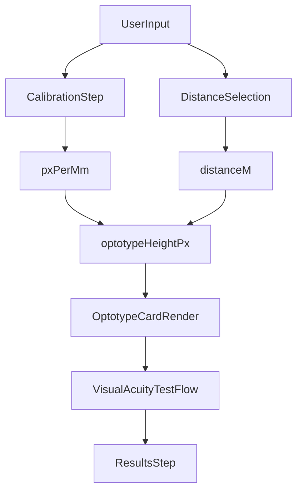

# Oftleonardo - Documento Técnico (Metodologia de Implementação)

A metodologia de implementação do aplicativo é apresentada com ênfase no módulo de acuidade visual digital. O conteúdo aborda os procedimentos de calibração, os cálculos de medida dos optótipos, os critérios de aplicabilidade de tamanho e espaçamento e a forma como o código processa esses dados ao longo do fluxo de execução.

## 1. Escopo do Sistema

O projeto consiste em uma aplicação web em Astro + React com os seguintes componentes funcionais:

- página institucional (`/`);
- teste de acuidade visual digital (`/acuidade-visual`);
- teste da grade de Amsler (`/tela-de-amsler`);
- páginas legais (`/politica-de-privacidade`, `/termos-de-uso`);
- avaliação remota síncrona, baseada em PIN, por meio de endpoints em `/api/live-session/*`.

## 2. Ambiente Tecnológico e Reprodutibilidade de Execução

### 2.1 Tecnologias principais

- `astro`: renderização e roteamento;
- `react`: interface interativa e gerenciamento de estados do fluxo de teste;
- `tailwindcss`: estilização e sistema visual;
- API serverless: orquestração da sessão remota (`create`, `join`, `configure`, `advance`, `stream`).

### 2.2 Procedimento de execução local

```bash
pnpm install
pnpm dev
pnpm build
pnpm preview
```

## 3. Organização Funcional por Páginas

### 3.1 Páginas de interface

- `src/pages/index.astro`: interface institucional.
- `src/pages/acuidade-visual.astro`: ponto de entrada da aplicação de acuidade (`VisualAcuityApp`).
- `src/pages/tela-de-amsler.astro`: triagem qualitativa com grade de Amsler.
- `src/pages/politica-de-privacidade.astro`: política de privacidade.
- `src/pages/termos-de-uso.astro`: termos de uso.

### 3.2 Endpoints para avaliação remota

- `src/pages/api/live-session/create.ts`: criação de sessão e emissão de PIN.
- `src/pages/api/live-session/join.ts`: ingresso de participante por PIN.
- `src/pages/api/live-session/configure.ts`: sincronização de parâmetros (distância e modo).
- `src/pages/api/live-session/advance.ts`: progressão do protocolo remoto.
- `src/pages/api/live-session/stream.ts`: transmissão de estado via SSE.

### 3.3 Endpoint de referências para n8n

- `src/pages/api/integrations/n8n/references.ts`: expõe FAQ e Hub de Conteúdos em JSON para uso do n8n.

Exemplo:

```text
GET /api/integrations/n8n/references
GET /api/integrations/n8n/references?includeArticleBody=true
```

## 4. Arquitetura Metodológica do Fluxo de Acuidade Visual

A orquestração do protocolo é implementada em `src/components/visual-acuity/VisualAcuityApp.tsx`, com progressão sequencial pelas etapas:

1. `instructions`
2. `calibration`
3. `distance`
4. `optotype-selection`
5. `test`
6. `results`

### 4.1 Diagrama de fluxo de dados (modo local)



## 5. Metodologia de Calibração de Tela

Referências de implementação: `src/components/visual-acuity/constants.ts` e `src/components/visual-acuity/CalibrationStep.tsx`.

### 5.1 Referência física adotada

Para padronização metrológica, o sistema utiliza as dimensões de cartão no formato ISO/IEC 7810 ID-1:

- largura: `85.6 mm`;
- altura: `53.98 mm`;
- razão geométrica:
  - `CREDIT_CARD_ASPECT_RATIO = 85.6 / 53.98`.

A calibração é realizada por ajuste visual do contorno projetado na interface, até coincidência com o cartão físico.

### 5.2 Estimativa da densidade linear de tela

Após a confirmação do ajuste, calcula-se:

```text
pxPerMm = cardHeightPx / 53.98
```

O parâmetro `pxPerMm` é persistido em `localStorage` para reutilização em sessões subsequentes:

- chave `va-calibration` (`LOCALSTORAGE_KEY`);
- posição do controle deslizante em `va-slider-position` (`SLIDER_POSITION_KEY`).

### 5.3 Distâncias operacionais

No motor de cálculo, as distâncias válidas são:

- `0.3 m` (`30 cm`);
- `0.5 m` (`50 cm`);
- `0.7 m` (`70 cm`).

O valor selecionado é persistido na chave `va-distance`.

### 5.4 Fundamentação no artigo de Messias et al. (2010)

Como referência metodológica adicional, foi utilizado o artigo disponível em `public/MESSIAS.pdf`:

- Messias A, Jorge R, Velasco e Cruz AA. *Tabelas para medir acuidade visual com escala logarítmica: porque usar e como construir*. Arq Bras Oftalmol. 2010;73(1):96-100.

Na seção de construção de tabelas, o artigo explicita três consensos aplicáveis ao desenho de optótipos:

1. progressão geométrica do tamanho dos optótipos com passo de `0,1 log` (razão aproximada `1,26`);
2. uso de optótipos com legibilidade similar;
3. espaçamento vertical entre linhas igual ao tamanho do optótipo da linha inferior.

Esses princípios orientam a justificativa geométrica adotada neste projeto e são usados neste README como base teórica para interpretação dos cálculos implementados.

## 6. Metodologia Matemática para Cálculo de Tamanho dos Optótipos

### 6.1 Definição angular de referência

O modelo adota o princípio angular da optotipia de Snellen/Sloan: na condição de referência 20/20, a altura total do optótipo deve subtender `5 arcmin` no plano do observador. Essa escolha torna o cálculo independente da resolução do dispositivo e dependente, primariamente, da geometria de observação (distância e ângulo visual).

- conversão angular:
  - `ARC_MINUTE_TO_RAD = pi / (180 * 60)`;
- ângulo base:
  - `5 * ARC_MINUTE_TO_RAD`.

**Justificativa técnica.** A unidade angular é convertida para radianos porque as funções trigonométricas do motor matemático (`tan`) operam nesse domínio. Sem essa conversão, a dimensão física calculada seria inconsistente.

No referencial de Messias et al. (2010), a acuidade visual é tratada como o inverso do ângulo visual limiar (`AV = 1/alpha`, com `alpha` em minutos de arco), e a notação logarítmica decorre de:

```text
MAR = 1 / AV_decimal
logMAR = log10(MAR)
```

No código atual, o pipeline utiliza diretamente o modelo angular para gerar tamanho físico, sem expor `logMAR` como saída numérica no resultado.

### 6.2 Cálculo da altura física base (20/20)

```text
base20Mm(distanceM) = distanceM * 1000 * tan(5 * ARC_MINUTE_TO_RAD)
```

**Interpretação da expressão.**

- `distanceM`: distância de teste em metros;
- `1000`: fator de conversão de metros para milímetros;
- `tan(5 * ARC_MINUTE_TO_RAD)`: relação geométrica entre ângulo visual e tamanho linear observado;
- `base20Mm`: altura física, em milímetros, do optótipo equivalente a 20/20 para a distância selecionada.

**Justificativa técnica.** A expressão deriva diretamente da geometria de triângulo retângulo aplicada à linha de visão. Assim, quando a distância aumenta, o optótipo cresce proporcionalmente para preservar o mesmo estímulo angular.

### 6.3 Escalonamento por denominador Snellen

Se `D` representa o denominador da linha Snellen:

```text
optotypeHeightMm(D, distanceM) = base20Mm(distanceM) * (D / 20)
```

**Interpretação da expressão.**

- `D/20`: fator de escala relativo à linha de referência 20/20;
- `optotypeHeightMm`: altura física final do optótipo para a linha desejada.

**Justificativa técnica.** O denominador Snellen atua como fator linear de ampliação/redução do símbolo. Por exemplo, `D = 40` implica duplicação da altura em relação ao 20/20; `D = 15` implica redução proporcional.

### 6.4 Conversão de milímetros para pixels

```text
optotypeHeightPx(D, pxPerMm, distanceM) = optotypeHeightMm(D, distanceM) * pxPerMm
```

**Interpretação da expressão.**

- `pxPerMm`: densidade linear efetiva estimada na calibração;
- `optotypeHeightPx`: tamanho em pixels utilizado na renderização.

**Justificativa técnica.** O estágio em milímetros preserva a validade geométrica; o estágio em pixels viabiliza a exibição no dispositivo. Essa separação (`m -> mm -> px`) evita acoplamento indevido entre regra clínica e implementação visual.

### 6.5 Exemplo numérico (distância de 0.5 m)

Para `distanceM = 0.5`:

- `base20Mm` ≈ `0.727 mm` (linha 20/20);
- linha 20/40: ≈ `1.454 mm`;
- linha 20/200: ≈ `7.272 mm`.

Com `pxPerMm = 8`, a altura estimada para 20/20 é aproximadamente `5.82 px`.

**Leitura metodológica do exemplo.** O objetivo do exemplo é demonstrar a cadeia causal do modelo: a distância define a dimensão física base; o denominador Snellen reescala essa dimensão; e a calibração converte a grandeza física em valor de tela renderizável.

## 7. Aplicabilidade de Tamanho e Espaçamento entre Optótipos

Referências de implementação: `src/components/visual-acuity/OptotypeCard.tsx`, `src/components/visual-acuity/SnellenLetter.tsx` e `src/components/visual-acuity/TumblingE.tsx`.

### 7.1 Regras de composição espacial da linha

Para cada linha de acuidade:

- número de optótipos: `5` (`OPTOTYPE_COUNT`);
- tamanho unitário:
  - `sizePx = max(optotypeHeightPx(...), 2)`;
- espaçamento horizontal:
  - `gapPx = sizePx`;
- largura total da linha:
  - `rowWidthPx = 5 * sizePx + 4 * gapPx`.

Portanto, a implementação adota relação de proporcionalidade 1:1 entre tamanho do símbolo e espaçamento intersimbólico horizontal.

**Convergência com Messias et al. (2010).** O artigo descreve, para tabelas completas, espaçamento horizontal entre optótipos (`x`) igual ao tamanho do optótipo e espaçamento vertical entre linhas (`z`) igual à altura do optótipo da linha subjacente. Neste aplicativo, como a interface exibe uma linha por vez no carrossel, a regra horizontal é aplicada diretamente, enquanto a regra vertical entre linhas não se materializa como grade simultânea multi-linhas.

### 7.2 Padronização de caixa para letras Sloan

O componente `SnellenLetter` renderiza cada caractere em caixa quadrada fixa:

- `width = size`;
- `height = size`;
- `fontSize = size`.

Essa estratégia reduz variações aparentes de largura entre letras e mantém consistência geométrica do arranjo.

### 7.3 Geometria vetorial do Tumbling E

O componente `TumblingE` implementa uma matriz geométrica de `5x5`:

- unidade estrutural: `s = size / 5`;
- barras e haste definidas por múltiplos de `s`;
- orientação aplicada por rotação (`up`, `down`, `left`, `right`).

## 8. Tratamento de Dados no Código (Entrada, Processamento e Renderização)

### 8.1 Entradas do usuário

- calibração da tela com referência física;
- seleção de distância de teste;
- seleção do modo de optótipo (`tumbling-e` ou `snellen-letters`);
- progressão do teste por olho (`OD`, seguido de `OE`).

### 8.2 Processamento computacional

- estimação de `pxPerMm` a partir da calibração;
- aplicação de distância em metros para derivação de altura física em milímetros;
- transformação de milímetros para pixels;
- composição dos optótipos com dimensões e espaçamentos derivados.

### 8.3 Reprodutibilidade das cartas ópticas

Em `constants.ts`, a sequência de estímulos é determinística:

- hash de semente (`hashSeed`);
- gerador pseudoaleatório determinístico (`makeSeededRng`, xorshift);
- chave de semente por contexto:
  - `${chartSeed}-${mode}-${eyeSide}-${level.snellen}`.

Esse procedimento assegura consistência intra-sessão para cada combinação de modo, olho e linha.

### 8.4 Critérios de progressão e desfecho

Em `VisualAcuityTest.tsx`:

- falha na primeira linha implica desfecho `< 20/200`;
- leitura completa até o nível final implica melhor acuidade (`20/16`);
- resultados são armazenados por olho (`od`, `os`).

Em `ResultsStep.tsx`, a classificação é baseada no denominador Snellen:

- `<= 20`: normal;
- `<= 40`: leve redução;
- `<= 100`: redução moderada;
- `> 100` ou `< 20/200`: redução importante.

## 9. Metodologia de Sessão Remota (Host e Participante)

No fluxo remoto (`VisualAcuityApp.tsx` + endpoints):

- host cria sessão (`create`) e recebe `PIN` e `ownerToken`;
- participante ingressa por PIN (`join`);
- estado clínico-operacional é sincronizado por SSE (`stream`);
- host define distância/modo (`configure`);
- host conduz progressão (`advance`).

Observação técnica: o host pode utilizar `HOST_PREVIEW_PX_PER_MM = 8` para pré-visualização operacional. Tal valor tem finalidade de condução da sessão, não de calibração física metrológica do dispositivo do host.

## 10. Limitações Técnicas e Condições de Validade

- o sistema possui finalidade de triagem e não substitui avaliação oftalmológica completa;
- a confiabilidade depende de calibração correta, distância física estável e condições adequadas de iluminação;
- não há validação automatizada de zoom de navegador, luminância ambiente ou distância por sensor;
- a página `tela-de-amsler` possui natureza qualitativa e não adota metrologia de optótipos.

## 11. Inconsistências Editoriais Identificadas

### 11.1 Menção a logMAR

Há menções a logMAR em conteúdo textual de `src/pages/acuidade-visual.astro`; entretanto, o motor computacional implementa explicitamente:

- escala Snellen por denominador;
- modelagem angular de 5 arcmin;
- conversão para milímetros e pixels.

No estado atual, não há cálculo explícito de logMAR no pipeline de resultados.

### 11.2 Recomendações de padronização editorial

Recomenda-se a adoção de uma das seguintes estratégias:

1. remover menções a logMAR do texto público; ou
2. implementar cálculo logMAR explícito no motor e expor o valor no resultado final.

## 12. Referências de Código

- `src/components/visual-acuity/constants.ts`
- `src/components/visual-acuity/CalibrationStep.tsx`
- `src/components/visual-acuity/DistanceSelection.tsx`
- `src/components/visual-acuity/OptotypeCard.tsx`
- `src/components/visual-acuity/SnellenLetter.tsx`
- `src/components/visual-acuity/TumblingE.tsx`
- `src/components/visual-acuity/VisualAcuityTest.tsx`
- `src/components/visual-acuity/ResultsStep.tsx`
- `src/components/visual-acuity/VisualAcuityApp.tsx`
- `src/pages/acuidade-visual.astro`

## 13. Referências Bibliográficas

- Messias A, Jorge R, Velasco e Cruz AA. Tabelas para medir acuidade visual com escala logarítmica: porque usar e como construir. *Arquivos Brasileiros de Oftalmologia*. 2010;73(1):96-100. DOI: `10.1590/S0004-27492010000100019`.
- Cópia de trabalho utilizada neste repositório: `public/MESSIAS.pdf`.
